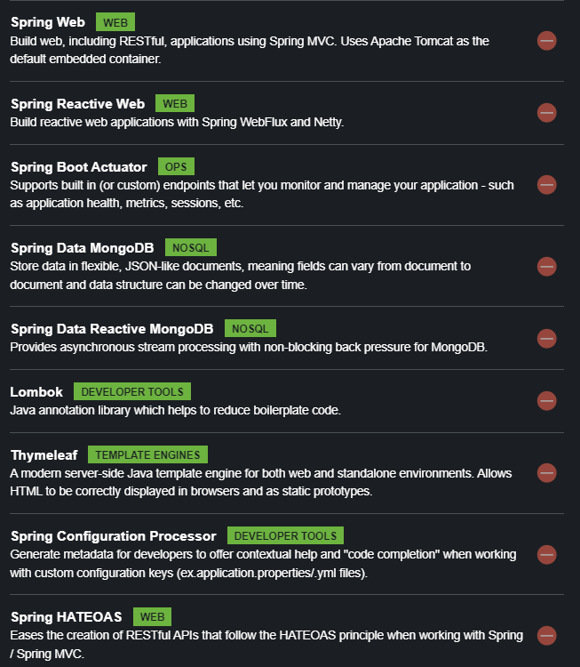

# Spring-Cloud-OpenFeign
# Spring Cloud OpenFeign
- Declarative REST Client: Feign

1. Include Feign

 

1. Getting Started

<pre><code class="hljs java"><button aria-live="Copy" class="button is-spring is-copy"></button>@SpringBootApplication
@EnableFeignClients
public class WebApplication {

	public static void main(String[] args) {
		SpringApplication.run(WebApplication.class, args);
	}

	@FeignClient("name")
	static interface NameService {
		@RequestMapping("/")
		public String getName();
	}
}
</code></pre>

# a concrete example: 
- we will create a challenger microservice with its dependencies
- pom.xml/gradle.build

  

- prepare the necessary models to receive the data in
  models package
  - class Challenge and subclasses...
  - 
in our case: 1 challenger is in relation with several challenges
we want to receive these challenges for each challenger

No create a service to request challenge microservice

<pre><code>
package challenger.services;

import java.util.UUID;

import org.springframework.cloud.openfeign.FeignClient;
import org.springframework.hateoas.PagedModel;
import org.springframework.web.bind.annotation.GetMapping;
import org.springframework.web.bind.annotation.PathVariable;

import challenger.models.Challenge;

@FeignClient(name = "challenge") // name of service that expose endpoints : challenge-microservice
public interface ChallengeRestService {

	@GetMapping("/challenges/{id}") // ?projection=fullChallenge")
	public Challenge challengeById(@PathVariable UUID id);

	@GetMapping("/challenges/Challenger/{id}")
	public PagedModel<Challenge> allChallengesByUserId(@PathVariable UUID id);

}
</code></pre>

